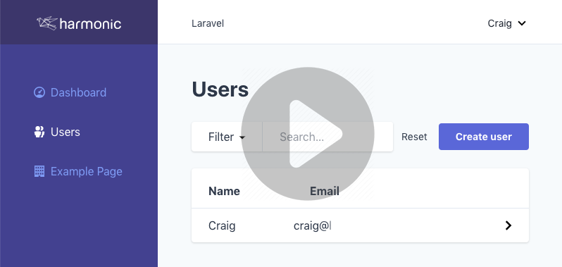

# Harmonic Laravel Preset

[![Latest Version on Packagist][ico-version]][link-packagist]
[![Total Downloads][ico-downloads]][link-downloads]

A Laravel preset that can create a basic Laravel install with some additional composer packages, Cypress for front end testing and an optional starting admin theme using InertiaJS and Tailwind CSS as a quick start.

[](https://www.youtube.com/watch?v=K_d_RboHBbI&feature=youtu.be)

## Installation

Before you start make sure you have: 

1) A new Laravel installation (this preset will overwrite laravel settings so do not use on existing projects)
2) yarn installed globally 
3) DB configured in your .env and migrations run (php artisan migrate)
      
Then install the preset with composer.

``` bash
$ composer require harmonic/laravel-preset --dev
```

## Usage

``` bash
$ php artisan preset harmonic
```

Once installed you will be prompted to remove the package (as it's no longer required). 

### Creating admin pages from models

You can easily and quickly create administration tables with the [Harmonic Inertia Table package](https://github.com/harmonic/inertia-table) that is installed as part of the theme. Simply create a migration then run the artisan command:

``` bash
php artisan make:inertiaTable ModelName
```
Where ModelName is the name of the model to create an inertia table from, or the name of the model to create based on the name of an existing table. For further details read the docs for the [Harmonic Inertia Table package](https://github.com/harmonic/inertia-table).

### Updating the Main Menu

You can manually add items to the left hand side menu by editing js/Shared/MainMenu.vue

### Customisation

Once installed you are free to modify all /resources as you see fit. You can easily customise the colour scheme of the theme by editing tailwind.config.js in the project root with the [Tailwind colours](https://tailwindcss.com/docs/customizing-colors/#default-color-palette) of your choice:

``` js
module.exports = {
	theme: {
		extend: {
			colors: {
				primary: colors.indigo,
				secondary: colors.orange,
				// ...
			  }
		}
	}
  }
```

## What's included?

### Composer Packages

- [harmonic/laravel-envcoder](https://github.com/Harmonic/laravel-envcoder) (dev)
- [bensampo/laravel-enum](https://github.com/BenSampo/laravel-enum) - optional
- [silber/bouncer:v1.0.0-rc.4](https://github.com/JosephSilber/bouncer) - optional
- [dyrynda/laravel-make-user](https://github.com/michaeldyrynda/laravel-make-user) (required if theme used)
- [sempro/phpunit-pretty-print](https://github.com/sempro/phpunit-pretty-print) (dev)
- [Jorijn/laravel-security-checker](https://github.com/sJorijn/laravel-security-checker) (dev)
- [harmonic/inertia-table](https://github.com/Harmonic/inertia-table) (required if theme used)

### Frontend

- [VueJS](https://github.com/vuejs/vue)
- [InertiaJS](https://github.com/inertiajs/inertia) (required if theme used)
- [Tailwind CSS](https://github.com/tailwindcss/tailwindcss) (optional)
- [Cypress](https://github.com/cypress-io/cypress) (optional)
- [Inertia Table Vue](https://github.com/Harmonic/inertia-table-vue) (required if theme used)
- [Vue Tailwind Modal](https://github.com/Harmonic/vue-tailwind-modal) (required if theme used)

### Stubs

- .gitignore (to include compiled assets)
- Removes sass, bootstrap and jquery
- Inertia JS configuration (installed with theme)
- Tailwind config (installed with theme)
- Cypress config (placing cypress inside /tests folder)
- Authentication stubs (installed with theme)
- Tailwind admin theme based on [Ping CRM](https://github.com/inertiajs/pingcrm) interface

## Credits

- [Craig Harman][link-author]
- Laravel 6 compatibility and general clean up by [atymic](https://github.com/atymic)
- [All Contributors][link-contributors]
- Based on [sixlive laravel preset](https://github.com/sixlive/laravel-preset)
- Admin UI based on [Ping CRM](https://github.com/inertiajs/pingcrm)

## License

Copyright Harmonic New Media

[ico-version]: https://img.shields.io/packagist/v/harmonic/laravel-preset.svg?style=flat-square
[ico-downloads]: https://img.shields.io/packagist/dt/harmonic/laravel-preset.svg?style=flat-square

[link-packagist]: https://packagist.org/packages/harmonic/laravel-preset
[link-downloads]: https://packagist.org/packages/harmonic/laravel-preset
[link-author]: https://github.com/harmonic
[link-contributors]: ../../contributors
